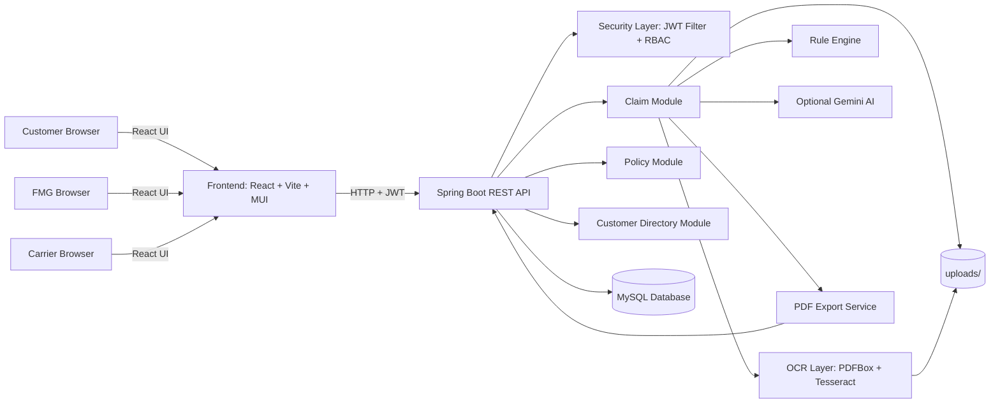
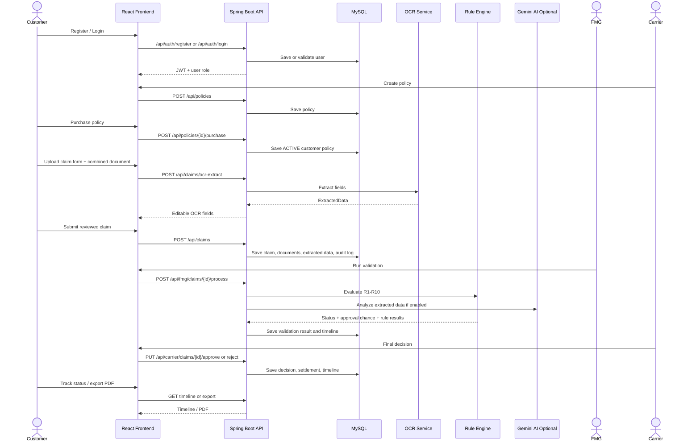
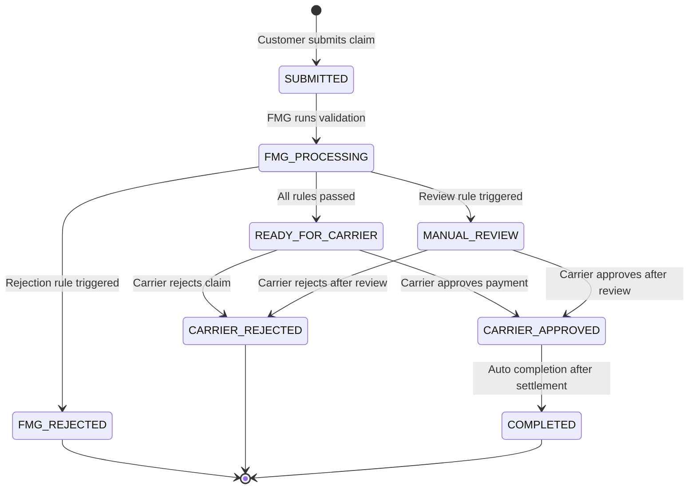
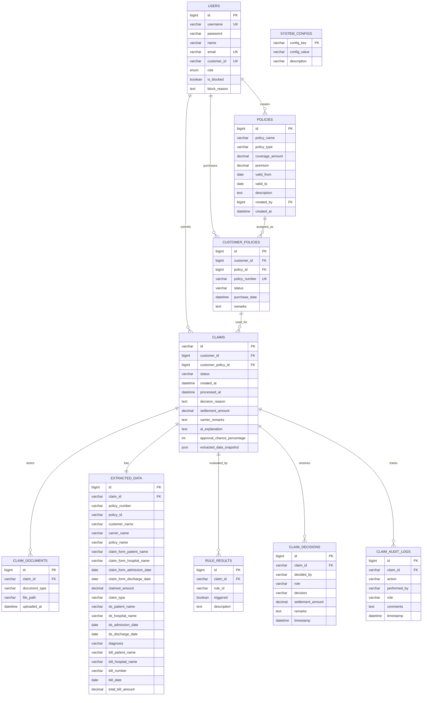

# TPA Insurance Claim Processing System

A full-stack insurance claim processing platform for Third Party Administrator (TPA) workflows. The system lets carriers create policies, customers purchase policies and submit medical claim documents, FMG users validate claims through OCR, business rules, and optional Gemini AI, and carriers make the final settlement decision.

The project is built for an end-to-end demo of a real medical insurance claim lifecycle: policy creation, policy purchase, document upload, OCR extraction, editable review, automated validation, final carrier adjudication, customer tracking, and PDF export.

---

## Table of Contents

1. [Project Summary](#project-summary)
2. [Tech Stack](#tech-stack)
3. [User Roles](#user-roles)
4. [Mermaid Diagram Index](#mermaid-diagram-index)
5. [High Level Design Mermaid Diagram](#high-level-design-hld---mermaid-diagram)
6. [Low Level Design Mermaid Diagram](#low-level-design-lld---mermaid-diagram)
7. [Project Flow Mermaid Diagram](#project-flow---mermaid-diagram)
8. [Claim Status Flow Mermaid Diagram](#claim-status-flow---mermaid-diagram)
9. [Database Schema Mermaid ER Diagram](#database-schema---mermaid-er-diagram)
10. [Backend Details](#backend-details)
11. [Frontend Details](#frontend-details)
12. [Rule Engine](#rule-engine)
13. [API Endpoints](#api-endpoints)
14. [How to Setup and Run](#how-to-setup-and-run)
15. [Demo Guide](#demo-guide)
16. [Project Structure](#project-structure)
17. [Future Enhancements](#future-enhancements)

---

## Project Summary

The application automates the claim journey for a health insurance process.

- **Carrier** creates insurance policies and performs final claim approval or rejection.
- **Customer** registers, purchases a policy, uploads required claim PDFs, reviews OCR-extracted data, submits claims, tracks progress, views documents, and exports claim reports.
- **FMG / TPA** validates submitted claims using OCR output, business rules, AI explanation, SLA monitoring, customer history, and rule configuration.

Important behavior in this implementation:

- FMG does **not** manually approve or reject claims.
- FMG runs OCR, rule validation, and AI-assisted analysis.
- The rule engine decides whether a claim becomes `READY_FOR_CARRIER`, `MANUAL_REVIEW`, or `FMG_REJECTED`.
- Carrier makes the final financial decision.
- Carrier approval automatically moves the claim to `COMPLETED`.

---

## Tech Stack

| Layer | Technology |
|---|---|
| Frontend | React 18, Vite, Material UI, Axios, React Router |
| Backend | Java 17, Spring Boot 3.1.5, Spring Web, Spring Security, Spring Data JPA |
| Authentication | JWT, BCrypt password hashing, role-based authorization |
| Database | MySQL 8 |
| OCR / Documents | Tess4J, Tesseract OCR, Apache PDFBox |
| AI | Optional Google Gemini API |
| PDF Export | OpenPDF |
| DevOps | Docker, Docker Compose, Nginx frontend container |
| API Docs | Springdoc OpenAPI / Swagger UI |

---

## User Roles

| Role | Backend Enum | Main Responsibilities |
|---|---|---|
| Customer | `ROLE_CUSTOMER` | Register, login, buy policies, submit claims, upload claim documents, review OCR data, track claim timeline, export claim PDF |
| FMG / TPA | `ROLE_FMG` | View submitted claims, run OCR/rule/AI validation, monitor SLA, view customer directory, block/unblock customers, update rule settings |
| Carrier | `ROLE_CARRIER` | Create/update/delete policies, view FMG-validated claims, approve/reject final payment, view customer directory, block/unblock customers |

Default seeded users:

| Username | Password | Role |
|---|---|---|
| `fmg` | `fmg123` | FMG |
| `carrier` | `carrier123` | Carrier |

Customers are created from the registration screen.

---

## Mermaid Diagram Index

This README includes the following Mermaid diagrams for project explanation:

| Diagram | What It Explains |
|---|---|
| HLD diagram | Overall system architecture: frontend, backend, database, OCR, AI, uploads |
| LLD diagram | Internal code-level design: pages, controllers, services, repositories |
| Project flow sequence diagram | Step-by-step claim process from login to final settlement |
| Claim status state diagram | How a claim moves between statuses |
| Database ER diagram | Tables and relationships used by the project |

If your editor does not render Mermaid, open the Markdown preview in GitHub, GitLab, or a Mermaid-supported VS Code preview extension. The diagram source is still present in the README inside fenced `mermaid` code blocks.

---

## High Level Design (HLD) - Mermaid Diagram



### HLD Explanation

- The frontend is a single-page React app served by Nginx in Docker.
- Spring Boot exposes REST APIs under `/api`.
- JWT authentication protects APIs after login.
- Role-based method security restricts sensitive actions.
- MySQL stores users, policies, claims, OCR data, decisions, rule results, audit logs, and system configuration.
- Uploaded documents are stored in the `uploads/` directory.
- OCR extraction uses direct PDF text extraction first, then Tesseract OCR for scanned documents.
- Gemini AI is optional. If disabled or unavailable, the system falls back to local extraction and local explanation.

---

## Low Level Design (LLD) - Mermaid Diagram

```mermaid
flowchart TB
    subgraph Frontend["frontend/src"]
        App["App.jsx: Routing, layout, auth context"]
        Login[Login.jsx]
        CustomerDash[CustomerDashboard.jsx]
        OcrReview[OcrReview.jsx]
        FmgDash[FmgDashboard.jsx]
        CarrierDash[CarrierDashboard.jsx]
        ClaimDetails[ClaimDetails.jsx]
        Timeline[ClaimTimeline.jsx]
    end

    subgraph Controllers["Backend Controllers"]
        AuthController[AuthController]
        PolicyController[PolicyController]
        ClaimController[ClaimController]
        FmgController[FmgController]
        CarrierController[CarrierController]
    end

    subgraph Services["Backend Services"]
        ClaimService[ClaimService]
        OcrService[OcrService]
        RuleEngine[RuleEngineService]
        AiService[AiValidationService]
        PolicyService[PolicyService]
        TimelineService[TimelineService]
        ConfigService[ConfigService]
        PdfService[PdfExportService]
        Mapper[ClaimMapper]
    end

    subgraph Repositories["Spring Data Repositories"]
        UserRepo[UserRepository]
        PolicyRepo[PolicyRepository]
        CustomerPolicyRepo[CustomerPolicyRepository]
        ClaimRepo[ClaimRepository]
        DecisionRepo[ClaimDecisionRepository]
        AuditRepo[ClaimAuditLogRepository]
        ConfigRepo[SystemConfigRepository]
    end

    App --> Login
    App --> CustomerDash
    App --> OcrReview
    App --> FmgDash
    App --> CarrierDash
    App --> ClaimDetails
    CustomerDash --> Timeline

    Login --> AuthController
    CustomerDash --> PolicyController
    CustomerDash --> ClaimController
    OcrReview --> ClaimController
    FmgDash --> FmgController
    CarrierDash --> CarrierController
    CarrierDash --> PolicyController
    ClaimDetails --> ClaimController

    AuthController --> UserRepo
    PolicyController --> PolicyService
    ClaimController --> ClaimService
    FmgController --> ClaimService
    FmgController --> ConfigService
    CarrierController --> ClaimService

    ClaimService --> OcrService
    ClaimService --> RuleEngine
    ClaimService --> AiService
    ClaimService --> TimelineService
    ClaimService --> ClaimRepo
    ClaimService --> DecisionRepo
    ClaimController --> PdfService
    ClaimController --> Mapper

    PolicyService --> PolicyRepo
    PolicyService --> CustomerPolicyRepo
    PolicyService --> ClaimRepo
    ConfigService --> ConfigRepo
    TimelineService --> AuditRepo
```



### Main Backend Components

| Component | Responsibility |
|---|---|
| `AuthController` | Login, customer registration, seed FMG and carrier users |
| `PolicyController` | Carrier policy CRUD, customer policy purchase, customer policy list |
| `ClaimController` | OCR extraction, claim submission, claim list/details, timeline, document view, PDF export |
| `FmgController` | FMG claim queue, validation trigger, customer directory, rule/SLA config |
| `CarrierController` | Carrier claim queue, final approve/reject, customer directory, policy management support |
| `ClaimService` | Main claim lifecycle orchestration |
| `OcrService` | PDF/text extraction, Tesseract OCR, local parsing, optional Gemini structured extraction |
| `RuleEngineService` | Ten validation rules and claim routing |
| `AiValidationService` | Gemini extraction/analysis when enabled, local fallback when disabled |
| `TimelineService` | Audit timeline entries |
| `PdfExportService` | Claim report generation |

---

## Project Flow - Mermaid Diagram



---

## Claim Status Flow - Mermaid Diagram



### Status Meaning

| Status | Meaning |
|---|---|
| `SUBMITTED` | Customer submitted claim and documents |
| `FMG_PROCESSING` | FMG validation is running |
| `READY_FOR_CARRIER` | Rules passed and carrier can make final decision |
| `MANUAL_REVIEW` | One or more review rules triggered; carrier review is required |
| `FMG_REJECTED` | Hard rejection rule triggered during validation |
| `CARRIER_APPROVED` | Carrier approved payment |
| `CARRIER_REJECTED` | Carrier rejected the claim |
| `COMPLETED` | Approved claim is fully settled |

---

## Database Schema - Mermaid ER Diagram



### Main Tables

| Table | Purpose |
|---|---|
| `users` | Stores login accounts, role, customer ID, blocked status |
| `policies` | Carrier-created insurance products |
| `customer_policies` | Purchased policies linked to customers |
| `claims` | Main claim record and lifecycle status |
| `claim_documents` | Uploaded claim form and combined medical document paths |
| `extracted_data` | OCR/AI extracted medical and claim fields |
| `rule_results` | Individual rule result rows for each claim |
| `claim_decisions` | Carrier final approval/rejection records |
| `claim_audit_logs` | Timeline entries shown in the UI |
| `system_configs` | Dynamic rule thresholds and SLA settings |

---

## Backend Details

### Authentication and Security

- Login endpoint returns a JWT token.
- Frontend stores auth data in `localStorage`.
- API requests pass `Authorization: Bearer <token>`.
- Spring Security uses a stateless session policy.
- `@PreAuthorize` protects role-specific controller methods.
- Passwords are encrypted with BCrypt.

### OCR and AI Extraction

The OCR flow in `OcrService` is:

1. Load uploaded PDF.
2. Try direct text extraction using PDFBox.
3. If direct text is not enough, render PDF pages and run Tesseract OCR.
4. Parse fields locally with regular expressions.
5. If local extraction is incomplete and Gemini is enabled, ask Gemini for structured JSON.
6. Merge AI values with local fallback values.
7. Return `ExtractedData` to the frontend for customer review.

### Claim Submission

The customer uploads exactly two documents:

- `CLAIM_FORM`
- `COMBINED_DOC`

The combined document represents discharge summary plus final hospital bill. Files are saved under `uploads/` with the claim UUID and document type in the filename.

### Timeline

Timeline events are stored in `claim_audit_logs`, for example:

- `CLAIM_SUBMITTED`
- `FMG_PROCESSED`
- `APPROVAL_CHANCE_ESTIMATED`
- `CARRIER_APPROVED`
- `CARRIER_REJECTED`
- `COMPLETED`

---

## Frontend Details

### Routes

| Route | Page | Access |
|---|---|---|
| `/login` | Login and registration | Public |
| `/` | Role-based dashboard | Authenticated |
| `/submit-claim` | OCR review and claim submission | Customer |
| `/claims/:id` | Claim detail view | Authenticated, customer can only view own claim |

### Pages

| Page | Purpose |
|---|---|
| `Login.jsx` | Login and customer registration |
| `CustomerDashboard.jsx` | Browse policies, purchased policies, claim list, timeline, PDF export |
| `OcrReview.jsx` | Upload documents, preview OCR data, edit fields, submit claim |
| `FmgDashboard.jsx` | Active claim queue, validation action, customer directory, rule settings |
| `CarrierDashboard.jsx` | Pending approvals, decision history, policy CRUD, customer directory |
| `ClaimDetails.jsx` | Full claim details, extracted data, documents, decision information |
| `ClaimTimeline.jsx` | Visual claim progress history |

---

## Rule Engine

Rules are evaluated in `RuleEngineService`.

| Rule | Description | Result Type |
|---|---|---|
| R1 | Claim form missing | Hard rejection |
| R2 | Combined document missing | Hard rejection |
| R3 | Policy inactive on admission date | Hard rejection |
| R4 | Policy number missing from documents | Manual review |
| R5 | Patient name mismatch across documents | Manual review |
| R6 | Hospital name mismatch across documents | Manual review |
| R7 | Admission/discharge date mismatch | Manual review |
| R8 | Claimed amount greater than total bill | Manual review |
| R9 | Claimed amount greater than configured threshold | Manual review |
| R10 | Possible duplicate claim for same policy, patient, hospital, and admission date | Manual review |

### Rule Outputs

- If any hard rejection rule is triggered, status becomes `FMG_REJECTED`.
- If no hard rejection occurs but one or more review rules trigger, status becomes `MANUAL_REVIEW`.
- If no rules trigger, status becomes `READY_FOR_CARRIER`.
- Approval chance is calculated and shown to the customer.

### Dynamic Configuration

Default configs are inserted by `ConfigService`:

| Key | Default | Purpose |
|---|---:|---|
| `RULE_R1_THRESHOLD` | `100000` | High amount threshold used by rule R9 |
| `RULE_R2_AGE_DAYS` | `30` | Reserved rule-age setting |
| `SLA_AMBER_HOURS` | `12` | FMG dashboard urgent threshold |
| `SLA_RED_HOURS` | `24` | FMG dashboard SLA breach threshold |

---

## API Endpoints

### Auth

| Method | Endpoint | Role | Purpose |
|---|---|---|---|
| `POST` | `/api/auth/register` | Public | Register customer |
| `POST` | `/api/auth/login` | Public | Login and receive JWT |

### Policies

| Method | Endpoint | Role | Purpose |
|---|---|---|---|
| `GET` | `/api/policies` | Authenticated | View all policies |
| `GET` | `/api/policies/{id}` | Authenticated | View policy details |
| `POST` | `/api/policies` | Carrier | Create policy |
| `PUT` | `/api/policies/{id}` | Carrier | Update policy |
| `DELETE` | `/api/policies/{id}` | Carrier | Delete policy if not purchased |
| `POST` | `/api/policies/{id}/purchase` | Customer | Purchase policy |
| `GET` | `/api/policies/my-policies` | Customer | View purchased policies |

### Claims

| Method | Endpoint | Role | Purpose |
|---|---|---|---|
| `POST` | `/api/claims/ocr-extract` | Customer | Upload documents and extract OCR fields |
| `POST` | `/api/claims` | Customer | Submit claim with documents and reviewed OCR data |
| `GET` | `/api/claims` | Customer | View own claims |
| `GET` | `/api/claims/{id}` | Authenticated | View claim details |
| `GET` | `/api/claims/{id}/timeline` | Authenticated | View claim timeline |
| `GET` | `/api/claims/{claimId}/documents/{docType}` | Authenticated | View uploaded PDF document |
| `GET` | `/api/claims/{id}/export` | Authenticated | Export claim report PDF |

### FMG

| Method | Endpoint | Role | Purpose |
|---|---|---|---|
| `GET` | `/api/fmg/claims` | FMG | View FMG claim queue and history |
| `POST` | `/api/fmg/claims/{id}/process` | FMG | Run OCR/rule/AI validation |
| `GET` | `/api/fmg/customers` | FMG | View customer directory |
| `GET` | `/api/fmg/customers/{id}` | FMG | View customer details |
| `PUT` | `/api/fmg/customers/{id}/block` | FMG | Block customer |
| `PUT` | `/api/fmg/customers/{id}/unblock` | FMG | Unblock customer |
| `GET` | `/api/fmg/config` | FMG | View rule/SLA config |
| `PUT` | `/api/fmg/config` | FMG | Update config |

### Carrier

| Method | Endpoint | Role | Purpose |
|---|---|---|---|
| `GET` | `/api/carrier/claims` | Carrier | View claims ready for final decision and history |
| `PUT` | `/api/carrier/claims/{id}/approve` | Carrier | Approve settlement and complete claim |
| `PUT` | `/api/carrier/claims/{id}/reject` | Carrier | Reject claim |
| `GET` | `/api/carrier/customers` | Carrier | View customer directory |
| `GET` | `/api/carrier/customers/{id}` | Carrier | View customer details |
| `PUT` | `/api/carrier/customers/{id}/block` | Carrier | Block customer |
| `PUT` | `/api/carrier/customers/{id}/unblock` | Carrier | Unblock customer |

Swagger UI is available at:

```text
http://localhost:8080/swagger-ui.html
```

---

## How to Setup and Run

### Prerequisites

For Docker setup:

- Docker
- Docker Compose

For local development:

- Java 17
- Maven
- Node.js 20 or compatible
- MySQL 8
- Tesseract OCR installed locally if OCR is tested outside Docker

### Run with Docker Compose

From the project root:

```bash
docker-compose up --build
```

Services:

| Service | URL / Port |
|---|---|
| Frontend | `http://localhost:3000` |
| Backend API | `http://localhost:8080` |
| MySQL | `localhost:3306` |
| Swagger UI | `http://localhost:8080/swagger-ui.html` |

Docker Compose starts:

- `db`: MySQL 8 database named `tpa_claims`
- `backend`: Spring Boot app with Tesseract installed
- `frontend`: React app built and served by Nginx

### Environment Variables

| Variable | Default | Description |
|---|---|---|
| `DB_HOST` | `localhost` / `db` in Docker | Database host |
| `DB_PORT` | `3306` | Database port |
| `DB_NAME` | `tpa_claims` | Database name |
| `DB_USER` | `root` | Database user |
| `DB_PASSWORD` | `root` | Database password |
| `JWT_SECRET` | Built-in default | JWT signing secret |
| `UPLOAD_DIR` | `uploads` | Upload directory |
| `GEMINI_ENABLED` | `false` | Enables Gemini calls |
| `GEMINI_API_KEY` | empty | Gemini API key |
| `GEMINI_MODEL` | `gemini-1.5-flash` | Gemini model name |

To enable Gemini in Docker:

```bash
set GEMINI_ENABLED=true
set GEMINI_API_KEY=your_api_key
docker-compose up --build
```

For PowerShell:

```powershell
$env:GEMINI_ENABLED="true"
$env:GEMINI_API_KEY="your_api_key"
docker-compose up --build
```

### Run Backend Locally

Start MySQL and create/use database `tpa_claims`, then:

```bash
cd backend
mvn spring-boot:run
```

Backend runs on:

```text
http://localhost:8080
```

### Run Frontend Locally

```bash
cd frontend
npm install
npm run dev
```

Vite usually runs on:

```text
http://localhost:5173
```

The frontend code currently calls:

```text
http://localhost:8080/api
```

So keep the backend running on port `8080`.

---

## Demo Guide

Use this order while explaining the project:

1. Start the app using Docker Compose.
2. Login as `carrier` / `carrier123`.
3. Create a policy from the Carrier dashboard.
4. Register a new customer from the login screen.
5. Login as that customer.
6. Browse policies and purchase the created policy.
7. Submit a claim using PDFs from `dummy_docs/`.
8. Review and edit OCR-extracted fields.
9. Submit the claim.
10. Login as `fmg` / `fmg123`.
11. Open the active queue and click **Run AI Validation**.
12. Explain rule results, approval chance, and SLA status.
13. Login as `carrier` / `carrier123`.
14. Open pending approvals.
15. Approve with settlement amount or reject with remarks.
16. Login as customer again and show final status, timeline, documents, and PDF export.

Sample documents are stored in:

```text
dummy_docs/
```

---

## Project Structure

```text
Final-Project/
|-- backend/
|   |-- Dockerfile
|   |-- pom.xml
|   `-- src/main/
|       |-- java/com/tpa/claim/
|       |   |-- controller/
|       |   |-- dto/
|       |   |-- model/
|       |   |-- repository/
|       |   |-- security/
|       |   |-- service/
|       |   `-- ClaimProcessingApplication.java
|       `-- resources/
|           `-- application.yml
|-- frontend/
|   |-- Dockerfile
|   |-- nginx.conf
|   |-- package.json
|   `-- src/
|       |-- components/
|       |-- pages/
|       |-- App.jsx
|       `-- main.jsx
|-- dummy_docs/
|   |-- claim_form.pdf
|   |-- combined_discharge_bill.pdf
|   |-- Dummy_Claim_Form.pdf
|   `-- Dummy_Combined_Doc.pdf
|-- uploads/
|-- docker-compose.yml
|-- e2e-test.ps1
`-- README.md
```

---

## Future Enhancements

- Add email/SMS notifications for claim status changes.
- Add payment gateway or settlement transaction module.
- Store uploaded files in S3/Azure Blob instead of local disk.
- Add stronger fraud analytics across customer claim history.
- Add admin dashboard for all carriers, FMG staff, and configuration.
- Add automated integration tests aligned with the current FMG validation flow.
- Add production profile with secured CORS, external secrets, and migration scripts.

---

## Quick Explanation Script

This project is a TPA insurance claim processing system. A carrier creates policies, a customer purchases a policy and submits claim documents, the system extracts claim data using OCR, the customer reviews the extracted data, FMG validates the claim using rules and optional AI, and the carrier makes the final settlement decision. The system keeps a complete timeline, stores decisions and rule results in MySQL, supports role-based dashboards, and allows PDF export of claim details.
